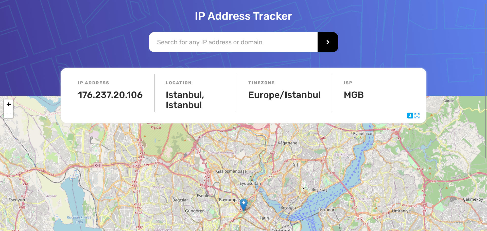

# IP address tracker

This is a solution to the [IP address tracker challenge on Frontend Mentor](https://www.frontendmentor.io/challenges/ip-address-tracker-I8-0yYAH0).

## Table of contents

- [Overview](#overview)
  - [The challenge](#the-challenge)
  - [Screenshot](#screenshot)
  - [Links](#links)
- [My process](#my-process)
  - [Built with](#built-with)
  - [What I learned](#what-i-learned)
  - [Useful resources](#useful-resources)
- [Author](#author)

## Overview

### The challenge

Users should be able to:

- View the optimal layout for each page depending on their device's screen size
- See hover states for all interactive elements on the page
- See their own IP address on the map on the initial page load
- Search for any IP addresses and see the key information and location

### Screenshot

### Links

- You can take a look [here](https://darrowv.github.io/ip-address-tracker)

## My process

### Built with

- Vite
- TypeScript
- Redux Toolkit
- Fetch Api
- Semantic HTML5 markup
- Sass/scss
- Flexbox
- CSS Grid
- Media queries
- API
- Intersection observer

### What I learned

- Using maps and geolocation API
- Refreshed my overall knowledges

### Useful resources

- [Leaflet - js library with interactive maps](https://leafletjs.com/)
- [Using Leaflet with React](https://react-leaflet.js.org/)
- [IP geolocation API](https://www.abstractapi.com/api/ip-geolocation-api)
- [How to move view in Leaflet maps](https://codesandbox.io/s/uemdn?file=/src/App.js)
- [Intersection observer](https://www.youtube.com/watch?v=wkztoWlwTXU)

## Author

- Github - [@darrowv](https://github.com/darrowv)
- Frontend Mentor - [@darrowv](https://www.frontendmentor.io/profile/darrowv)
- LinkedIn - [Nasyr Akhmadov](https://linkedin.com/in/darrowv)
- Telegram - [Muhammad Nasyr](https://t.me/m_nasyr)

### Powered by [abstractapi](https://www.abstractapi.com/api/ip-geolocation-api)